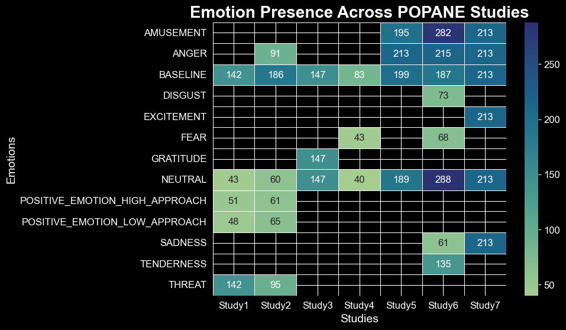
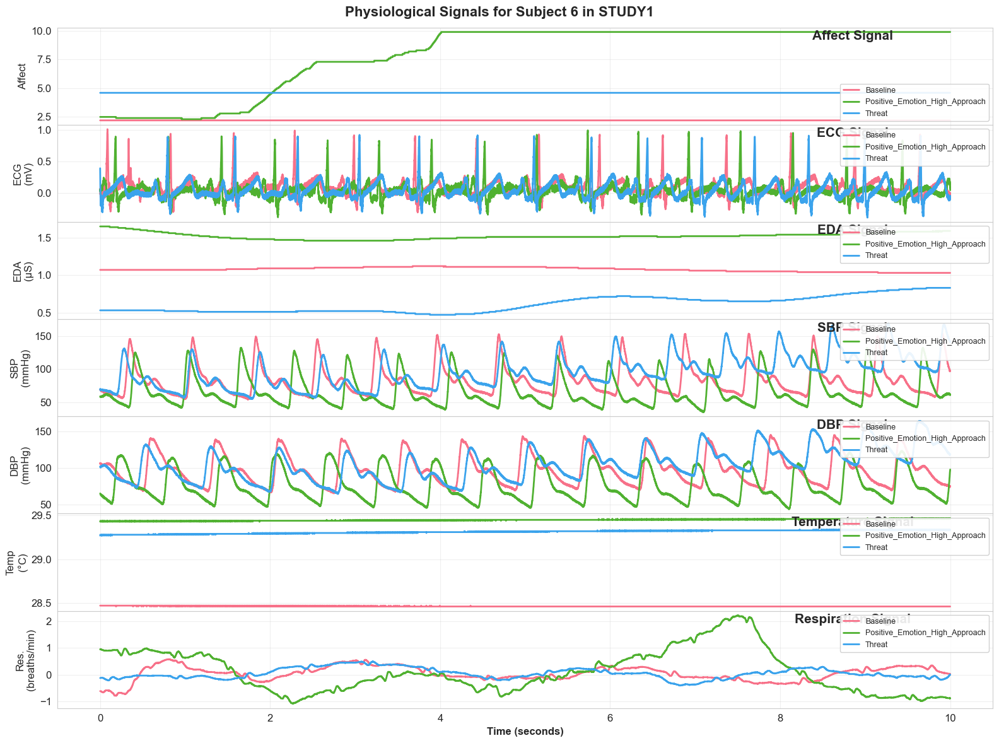
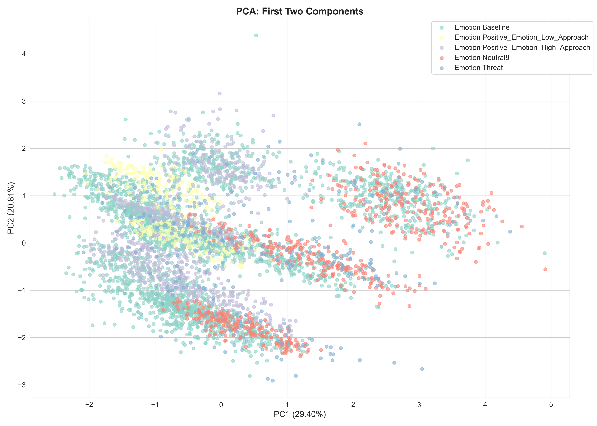
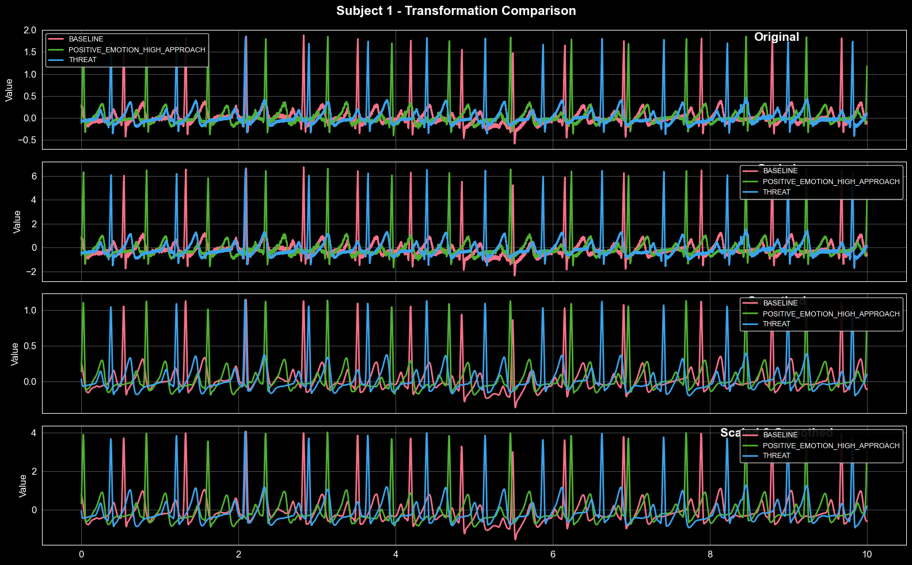
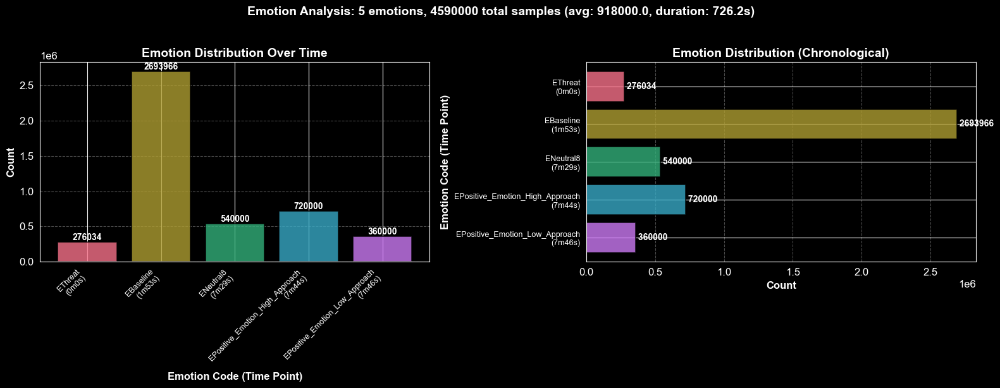
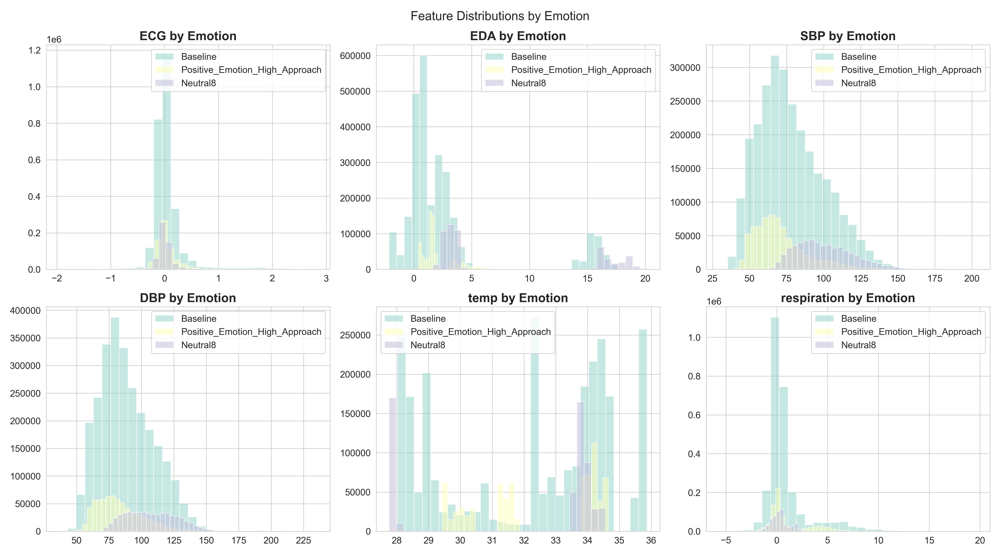
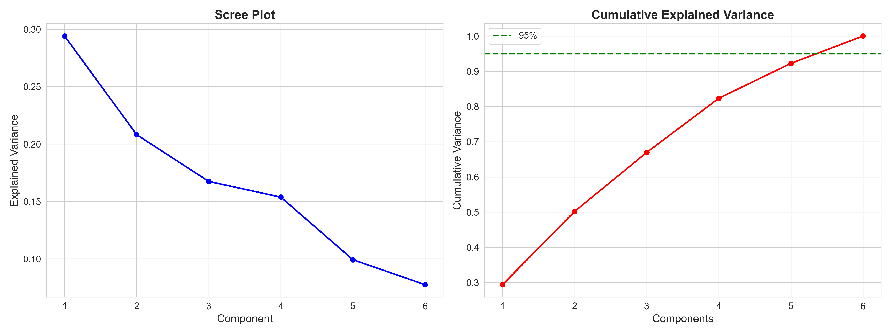
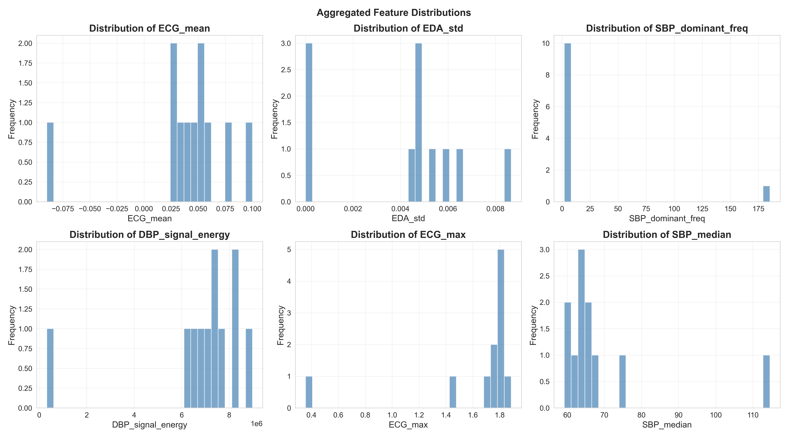
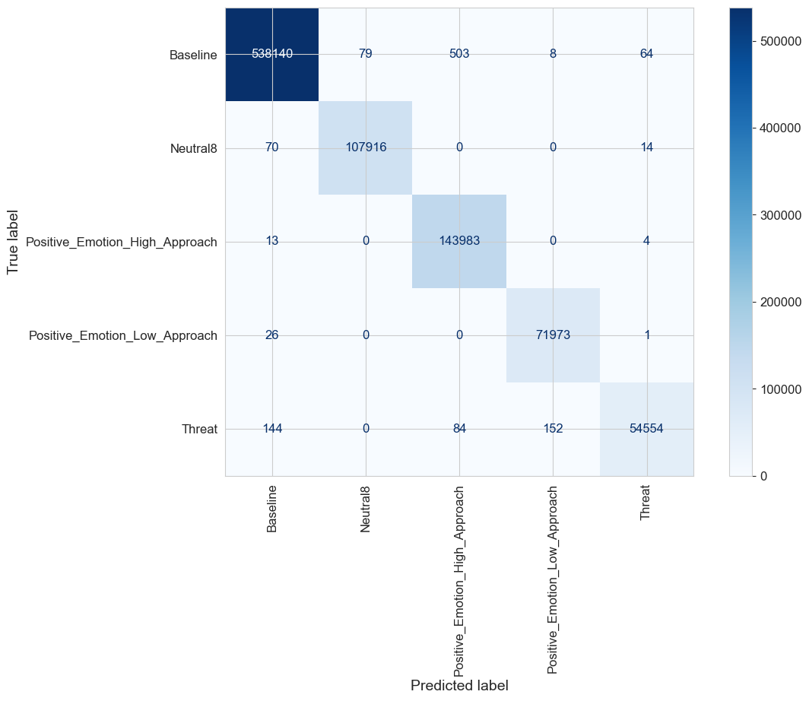
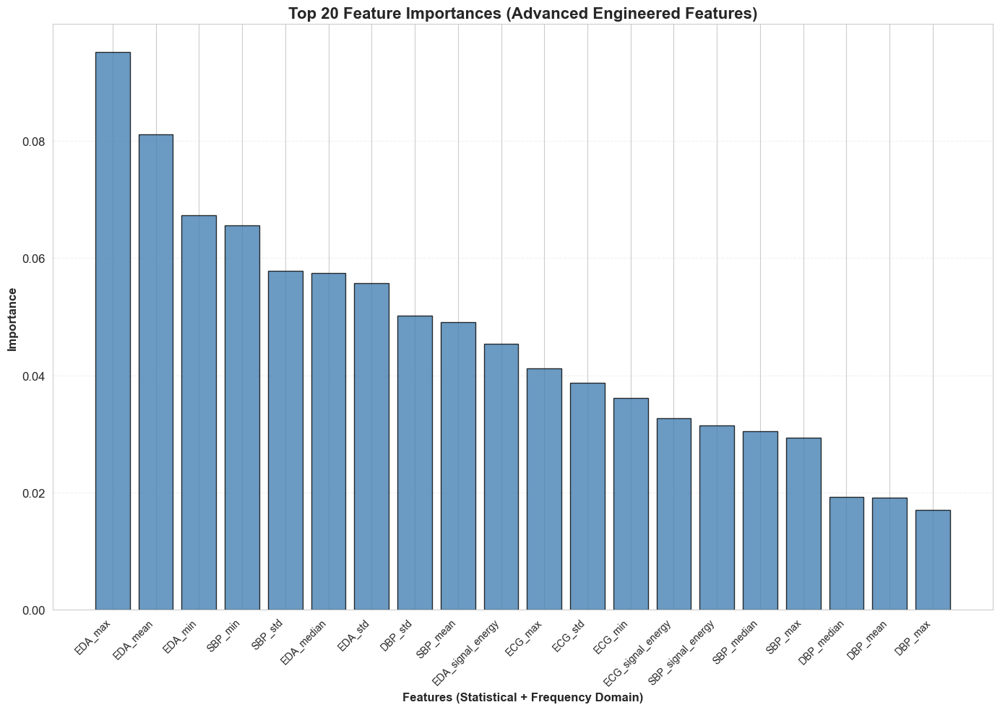

# POPANEpy  

A comprehensive Python package for analyzing physiological signals and emotion classification from the POPANE (Physiological Observation of Person Affect and Negative Emotions) dataset.




## Overview

POPANEpy provides a unified interface for:
- Loading and accessing emotion study data from 7 different studies
- Preprocessing physiological signals (ECG, EDA, blood pressure, respiration, temperature)
- Feature extraction and frequency domain analysis
- Emotion classification using machine learning
- Visualization and statistical analysis
- DuckDB-based data storage for efficient querying

## Features

- **Unified API**: `POPANE` facade class provides simple access to all 7 studies
- **Data Management**: Automated data downloading and DuckDB integration
- **Signal Processing**: Frequency filters (highpass, notch, multipass), frequency domain features
- **Machine Learning**: Random Forest classifier for emotion prediction
- **Cross-Study Analysis**: Tools for finding overlapping features and emotions across studies
- **Visualization**: Plotting utilities for signals and analysis results

## Installation

```bash
# Clone the repository
git clone https://github.com/magana272/POPANEpy.git
cd POPANEpy

# Create virtual environment
python -m venv .venv
source .venv/bin/activate  # On Windows: .venv\Scripts\activate

# Install the package
pip install -e .
```

## Quick Start

```python
from emotion import POPANE
from emotion.dataloader.popaneloader import POPANEDataLoader

# Initialize the POPANE interface
popane = POPANE()

# Download data if needed
loader = POPANEDataLoader()
loader.download_data()

# Get unique emotions from Study 1
emotions = popane.get_unique_emotions(1)

# Get subject IDs for a study
subject_ids = popane.get_subject_ids(1)

# Get subject data
subject = popane.get_subject(study_number=1, subject_id=subject_ids[0])

# Get study metadata
metadata = popane.get_study_metadata(1)

# Get overlapping features across multiple studies
common_features = popane.get_overlap_features_across_studies([1, 2, 3])

# Get all unique emotions across all studies
all_emotions = popane.get_unique_emotions_for_all_studies()
```

## API Reference

### Main POPANE Class (`emotion.POPANE`)

The `POPANE` class is the primary interface for accessing study data:

- `get_study(study_number: int)` - Get a specific study instance
- `get_unique_emotions(study_number: int)` - Get unique emotions in a study
- `get_unique_emotions_for_all_studies()` - Get all unique emotions across all studies
- `get_subject_ids(study_number: int)` - Get list of subject IDs
- `get_subject(study_number: int, subject_id: int)` - Get subject data
- `get_study_metadata(study_number: int)` - Get study metadata
- `get_subjects_by_emotion(study_number: int, emotions: list[str])` - Filter subjects by emotion
- `get_overlap_features_across_studies(study_numbers: list[int])` - Get common features
- `get_all_features()` - Get all unique features across all studies
- `get_stimuli_meta()` - Get stimuli metadata for emotion mapping

### Data Loading (`emotion.dataloader`)

**POPANEDataLoader:**
- `download_data()` - Download raw study data from remote storage
- `get_data_for_subject_from_study(study, subject_id)` - Load specific subject data
- `unzip_files()` - Extract compressed study files

### Preprocessing - Data Processing (`emotion.preprocessing.dataprocess`)

**Transformers:**
- `ECGSmoothTransformer(sigma)` - Gaussian smoothing transformer for signals
  - `fit(X, y)` - Fit transformer
  - `transform(X, y)` - Apply Gaussian smoothing

**Signal Processing:**
- `window_data(dataset, window_size, steps)` - Convert dataset into overlapping windows
- `rolling_mean(series, window_size)` - Apply rolling mean to series
- `exponential_moving_average(series, span)` - Apply exponential moving average
- `apply_rollingmean(df, feature, window_size)` - Apply rolling mean to dataframe feature
- `apply_rollingmedian(df, feature, window_size)` - Apply rolling median to dataframe feature
- `apply_ema(df, feature, span)` - Apply exponential moving average to dataframe feature

**Visualization:**
- `visualize_transformations(study, subject_id, data_path, figsize, start_end, sigma)` - Visualize signal transformations
- `visualize_sigma_comparison(study, subject_id, sigmas, figsize, time_start, time_end)` - Compare different sigma values
- `clean_DBP(subject_data)` - Visualize and clean DBP signals with median filtering
- `plot_transformations(df, time, signal, title, color, axis, label)` - Plot signal transformations

**Feature Engineering:**
- `create_aggregated_features(dataset, resample_window, batch_size)` - Generate statistical + frequency domain features

### Preprocessing - Frequency Analysis (`emotion.preprocessing.frequency`)

**Filters:**
- `highpass_0_5hz(data, fs)` - Apply 0.5Hz highpass filter
- `notch_filter(data, freq, fs, Q)` - Remove specific frequency noise
- `mutlipass_filter(data, fs)` - Apply combined filtering pipeline

**Analysis:**
- `frequency_analysis(subject)` - Perform FFT analysis by emotion
- `get_dominant_frequency(xf, yf)` - Extract dominant frequency from FFT
- `calculate_signal_energy(yf)` - Calculate total signal energy

**Feature Extraction:**
- `FrequencyDomainFeatureExtractor(sampling_rate)` - Extract frequency features
  - `compute_fft(signal)` - Compute FFT of signal
  - `extract_features(signal)` - Extract dominant frequency, signal energy, etc.

### Preprocessing - Analysis (`emotion.preprocessing.analysis`)

**PCA & Visualization:**
- `plot_pca(X, y)` - Visualize PCA results with scatter plots

**Cross-Study Analysis:**
- `get_unique_emotions_for_all_studies(popane_data_loader)` - Get all emotions across studies
- `generate_emotion_presence_matrix(all_emotions, popane_data_loader)` - Create emotion availability matrix
- `generate_heatmap(emotion_matrix)` - Visualize emotion distribution heatmap
- `generate_study_size_bar_chart(popane_data_loader)` - Compare dataset sizes

### Visualization (`emotion.visualization.figure`)

**POPANEFigureGenerator:**
- `plot_signals(t, signal, color, label, title, axis, **kwargs)` - Plot physiological signals
- `create_figure_for_subject(df, subject_id, start_end)` - Create multi-panel subject plots
- `create_figure_one_per_study(study, start_end)` - Generate figures for all subjects in study

### Machine Learning (`emotion.models.random_forest`)

**EmotionRandomForest:**
- `__init__(n_estimators, random_state)` - Initialize Random Forest classifier
- `fit(X, y)` - Train the model
- `predict(X)` - Make predictions
- `evaluate(X, y)` - Evaluate model accuracy
- `feature_importances()` - Get feature importance scores
- `save_model(filepath)` - Save model to disk
- `load_model(filepath)` - Load model from disk

### Database (`emotion.db.db`)

- `createDB()` - Create DuckDB database from loaded data (saves to `data/processed/popane_emotion.db`)

### Utilities (`emotion.utils`)

- `get_size(path)` - Get directory or file size in human-readable format

## Project Structure

```
POPANEpy/
├── src/emotion/
│   ├── __init__.py         # Package initialization, exports POPANE facade
│   ├── core/               # Core POPANE API implementation (facade class)
│   ├── studies/            # Study1-7 classes and Subject/Metadata models
│   ├── dataloader/         # POPANEDataLoader and SubjectLoader
│   ├── preprocessing/      # Signal processing, frequency analysis, data cleaning
│   ├── models/             # Random Forest classifier
│   ├── visualization/      # Figure generation utilities
│   ├── db/                 # DuckDB database management
│   └── utils/              # Helper functions
├── data/
│   └── raw/                # Downloaded raw study data
├── notebooks/
│   └── analysis.ipynb      # Analysis workflow notebook
├── test/                   # Comprehensive unit tests
│   ├── test_db.py
│   ├── test_frequency.py
│   ├── test_models.py
│   ├── test_popane.py
│   ├── test_popaneloader.py
│   ├── test_preprocessing.py
│   ├── test_studies.py
│   ├── test_utils.py
│   └── test_visualization.py
├── main.py                 # Example usage script
└── pyproject.toml          # Project configuration
```

## Testing

The project includes comprehensive unit tests covering all major components:

```bash
# Run all tests
pytest test/

# Or using unittest
python -m unittest discover test/
```

**Test Modules:**
- `test_db.py` - Database management and schema validation
- `test_frequency.py` - Frequency filters and signal processing
- `test_models.py` - Random Forest classifier
- `test_popane.py` - Main POPANE API
- `test_popaneloader.py` - Data loading functionality
- `test_preprocessing.py` - Data preprocessing utilities
- `test_studies.py` - Study classes and metadata
- `test_utils.py` - Utility functions
- `test_visualization.py` - Plotting and visualization

## Analysis Results

The package includes a complete analysis notebook (`notebooks/analysis.ipynb`) demonstrating:

- **Data Loading**: Efficient querying from DuckDB database
- **Signal Preprocessing**: Visualization of transformations (scaling, smoothing) and frequency filtering (highpass, notch, multipass)
- **Frequency Analysis**: FFT analysis, dominant frequency detection, and signal energy calculation
- **EDA**: Emotion distribution analysis with temporal time points and feature statistics
- **Visualization**: Multi-signal plots using POPANEFigureGenerator
- **Advanced Feature Engineering**: Aggregated statistical features (mean, std, min, max, median) + frequency domain features (dominant_freq, signal_energy)
- **PCA Analysis**: Dimensionality reduction showing ~95% variance captured in first few components
- **ML Classification**: Random Forest trained on 100+ engineered features achieving improved accuracy
- **Feature Importance**: Analysis of top predictive features across statistical and frequency domains

All generated figures are saved in the `figures/` directory and include:
- Emotion distribution charts with time point labels (chronological ordering)
- Frequency filtering comparison plots
- Feature distributions by emotion
- Aggregated feature distributions
- PCA explained variance plots
- 2D PCA visualizations
- Confusion matrix
- Feature importance rankings (top 20 features)

## Usage Examples

### Complete Analysis Workflow

The `notebooks/analysis.ipynb` demonstrates data loading, visualization, and machine learning using these key functions:

```python
# Core API
POPANE()
popane.get_stimuli_meta()

# Database
duckdb.connect(database, read_only)
conn.execute(query).fetchdf()

# Data manipulation
df.merge(other, how, on)
df.rename(columns)
```

### Signal Preprocessing & Filtering

```python
# Visualization
visualize_transformations(study, subject_id, data_path, figsize, start_end, sigma)

# Frequency Filters
highpass_0_5hz(signal, fs)
notch_filter(signal, freq, fs)
mutlipass_filter(signal, fs)

# Feature Extraction
FrequencyDomainFeatureExtractor(sampling_rate)
extractor.extract_features(signal)  # Returns: {dominant_frequency, signal_energy, ...}
```



### Exploratory Data Analysis with Time Points

```python
# Data aggregation with temporal ordering
df.groupby(['EMOTION', 'timestamp']).size()
df.groupby('EMOTION').agg({'timestamp': ['min', 'max', 'count']})
df.sort_values('start_time')

# Visualization
plt.subplots(nrows, ncols, figsize)
sns.color_palette(palette, n_colors)
axes.bar(x, height, color, alpha, edgecolor, linewidth)
axes.barh(y, width, color, alpha, edgecolor, linewidth)
axes.set_xlabel(label, fontsize, fontweight)
axes.set_title(title, fontsize, fontweight)
fig.suptitle(title, fontsize, fontweight, y)
plt.savefig(filename, dpi, bbox_inches)
```



### Feature Analysis by Emotion

```python
# Compare distributions across emotions
df['EMOTION'].value_counts().head(n)
df[df['EMOTION'].isin(emotions)]

# Multi-panel histogram visualization
plt.subplots(nrows, ncols, figsize)
ax.hist(data, alpha, bins, label)
ax.set_title(title)
ax.legend()
plt.suptitle(title, fontsize)
```



### Principal Component Analysis (PCA)

```python
# Dimensionality reduction
StandardScaler()
scaler.fit_transform(X)

PCA(n_components)
pca.fit_transform(X_scaled)
pca.explained_variance_ratio_

# Visualization
np.cumsum(array)
axes.plot(x, y, marker)
axes.axhline(y, color, linestyle, label)
```



### PCA 2D Visualization

```python
# Scatter plot of first two components
plt.figure(figsize)
plt.scatter(x, y, alpha, s, label)
plt.xlabel(label)
plt.ylabel(label)
plt.title(title)
plt.legend(bbox_to_anchor)
```


### Advanced Feature Engineering

```python
# Create aggregated statistical + frequency features
create_aggregated_features(df, resample_window, batch_size)
# Returns: DataFrame with features like ECG_mean, ECG_std, ECG_dominant_freq, ECG_signal_energy, etc.

# Feature selection
df.select_dtypes(include)
df.columns
df[feature_cols].dropna()
```



### Machine Learning with Advanced Features

```python
# Label encoding and data splitting
LabelEncoder()
le.fit_transform(y)
train_test_split(X, y, test_size, random_state, stratify)

# Model training
RandomForestClassifier(n_estimators, max_depth, min_samples_leaf, max_features, n_jobs, random_state)
rf_model.fit(X_train, y_train)
rf_model.predict(X_test)

# Evaluation
accuracy_score(y_true, y_pred)
classification_report(y_true, y_pred)
confusion_matrix(y_true, y_pred)
ConfusionMatrixDisplay(confusion_matrix, display_labels)
```



### Feature Importance Analysis

```python
# Extract and rank feature importances
rf_model.feature_importances_
np.argsort(array)[::-1]

# Visualization
plt.bar(x, height, color, alpha, edgecolor)
plt.xticks(ticks, labels, rotation, ha, fontsize)
plt.xlabel(label, fontweight, fontsize)
plt.ylabel(label, fontweight, fontsize)
plt.title(title, fontsize, fontweight)
plt.grid(axis, alpha, linestyle)
```



### Working with Studies

```python
POPANE()
popane.get_study(study_number)
popane.get_subjects_by_emotion(study_number, emotions)
popane.get_subject(study_number, subject_id)
subject.to_dataframe()
```

### Signal Processing

```python
highpass_0_5hz(signal, fs)
notch_filter(signal, freq, fs)
mutlipass_filter(signal, fs)
```

### Frequency Domain Analysis

```python
FrequencyDomainFeatureExtractor(sampling_rate)
extractor.extract_features(signal)
```

### Training a Classifier

```python
EmotionRandomForest(n_estimators, random_state)
model.fit(X_train, y_train)
model.evaluate(X_test, y_test)
model.predict(X_test)
model.feature_importances()
```

### Database Access

```python
createDB()  # Creates database at data/processed/popane_emotion.db
```

## Complete Utility Functions Reference

The analysis workflow utilizes a comprehensive set of utility functions across multiple modules:

### Visualization (`emotion.visualization.figure`)
- `POPANEFigureGenerator.plot_signals()` - Plot physiological signals with customizable styling
- `POPANEFigureGenerator.create_figure_for_subject()` - Create multi-panel plots showing all signals for a subject

### Preprocessing (`emotion.preprocessing.dataprocess`)
- `visualize_transformations()` - Compare Original, Scaled, Smoothed, and Scaled+Smoothed signals
- `ECGSmoothTransformer` - Gaussian smoothing transformer for signal noise reduction
- `create_aggregated_features()` - Generate statistical + frequency features from time-series data
- `clean_DBP()` - Rolling median filtering for blood pressure signals

### Frequency Analysis (`emotion.preprocessing.frequency`)
- `highpass_0_5hz()` - Remove low-frequency drift (< 0.5Hz) from signals
- `notch_filter()` - Remove specific frequency noise (e.g., 60Hz power line interference)
- `mutlipass_filter()` - Combined filtering pipeline with multiple filter stages
- `frequency_analysis()` - FFT analysis and visualization by emotion
- `FrequencyDomainFeatureExtractor` - Extract features: dominant frequency, signal energy, spectral entropy

### Cross-Study Analysis (`emotion.preprocessing.analysis`)
- `plot_pca()` - PCA visualization with variance explained
- `generate_emotion_presence_matrix()` - Create cross-study emotion availability heatmap
- `generate_heatmap()` - Visualization of emotion distribution across studies
- `generate_study_size_bar_chart()` - Compare dataset sizes across all 7 studies

These utilities enable end-to-end signal processing, feature engineering, and visualization workflows as demonstrated in `notebooks/analysis.ipynb`.

## Contributing

Contributions are welcome! Please:
1. Fork the repository
2. Create a feature branch
3. Add tests for new functionality
4. Submit a pull request

## License

This project is licensed under the MIT License.

## Dependencies

Core dependencies (specified in `pyproject.toml`):
- pandas - Data manipulation
- polars - Fast dataframe operations
- numpy - Numerical computing
- scipy - Signal processing
- matplotlib - Plotting
- seaborn - Statistical visualization
- scikit-learn - Machine learning
- duckdb - Database management
- requests - HTTP requests for data downloading

## Citation

If you use POPANEpy in your research, please cite:

```bibtex
@software{popanepy2024,
  title={POPANEpy: A Python Package for Emotion Analysis from Physiological Signals},
  author={Manuel Magana},
  year={2024},
  url={https://github.com/magana272/POPANEpy}
}
```

## Acknowledgments

- POPANE dataset providers
- Contributors and maintainers
- Scientific Python community (NumPy, Pandas, Polars, Scikit-learn, Matplotlib, SciPy)

## Contact

For questions or issues, please open an issue on [GitHub](https://github.com/magana272/POPANEpy).
